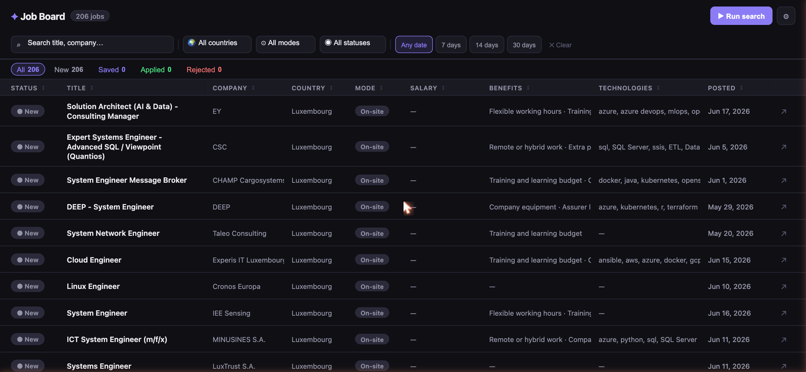
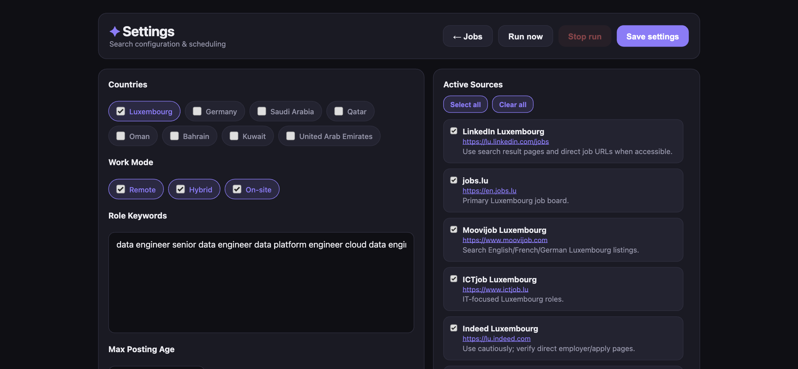

# Job Board

A personal job aggregator that scrapes multiple job boards daily, stores results in a local SQLite database, and serves a Notion-style table UI for tracking applications.



## Features

- **Multi-source scraping** — LinkedIn, jobs.lu, Moovijob, ICTJob, Indeed Luxembourg
- **Smart filters** — search, country, work mode, status, and date range (7 / 14 / 30 days)
- **Status tracking** — mark jobs as New / Saved / Applied / Rejected with one click or keyboard shortcuts
- **Per-job notes** — auto-saved with 800 ms debounce
- **Applied date** — automatically recorded when status is set to Applied
- **Progressive results** — jobs appear as each source finishes, no waiting for the full run
- **Daily scheduler** — configure a run time; the server fires it automatically each morning
- **Status counts bar** — live counts of All · New · Saved · Applied · Rejected
- **Mobile-friendly** — card layout on phone (≤ 640 px), full-width side panel, touch-optimised filters

## Requirements

- **Node.js 22+** (uses the built-in `node:sqlite` module — no npm install needed)

## Setup

```bash
git clone <repo-url>
cd "Job Research"
node settings_server.js
```

## Configuration



Open **Settings** to configure:

| Setting | Description |
|---------|-------------|
| Countries | Toggle which countries to search |
| Work mode | Remote, Hybrid, On-site |
| Role keywords | One keyword per line (e.g. `data engineer`) |
| Max posting age | Only fetch jobs posted within N days |
| Active sources | Enable/disable individual job boards |
| Schedule | Daily auto-run time (hour + minute) |

## Running a search

Click **▶ Run search** in the job board toolbar, or **Run now** in Settings. Results stream in progressively as each source finishes. A **Stop** button cancels mid-run.

To trigger from the command line:

```bash
node run_now.js
```

## Keyboard shortcuts

Open a job row to open the side panel, then:

| Key | Action |
|-----|--------|
| `S` | Mark as Saved |
| `A` | Mark as Applied |
| `R` | Mark as Rejected |
| `Esc` | Close panel |

## File layout

```
settings_server.js      — HTTP server + SQLite API
run_now.js              — scraper (called by server or CLI)
job_sources.json        — source definitions
job_search_config.json  — user config (keywords, countries, schedule)
index.html              — job board UI
settings.html           — settings UI
screenshots/            — README screenshots
jobs.db                 — SQLite database (gitignored)
```

## Privacy

All data is stored locally in `jobs.db`. Nothing is sent to external services. The database and any token files are excluded from git via `.gitignore`.
